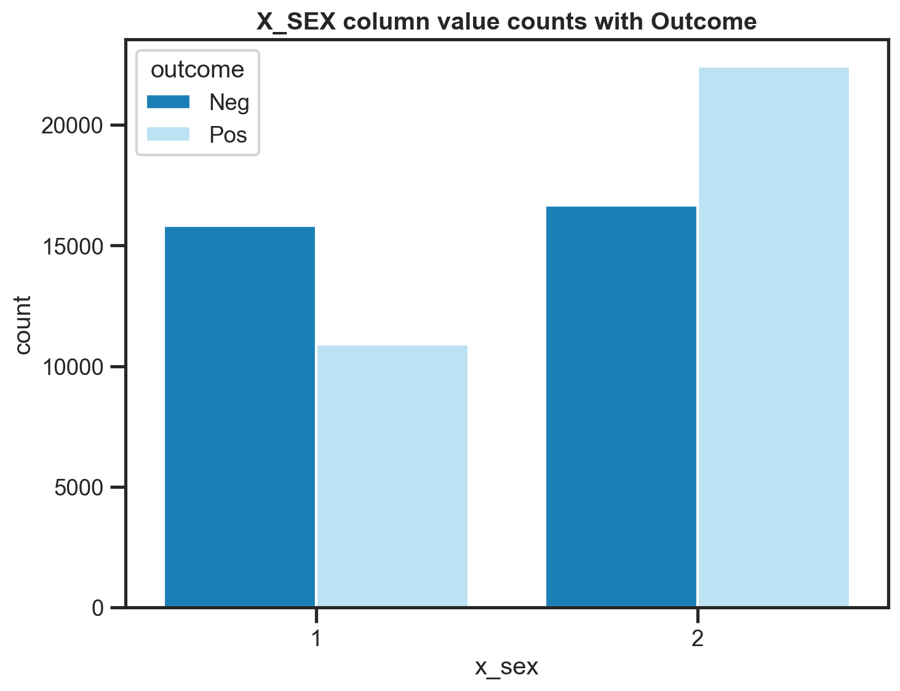

 
 
 
 

 
     
        <b>HDRUK GROUP 4 REPORT</b>
    

 
 
 
 
 

 
     
        <b>MENTAL HEALTH DISORDER PREDICTION  USING SUPERVISED MACHINE LEARNING ALGORITHMS</b>
    

 
 
 
 
 
 
 

 
     
        <b>TEAM MEMBERS:</b>
    

 
     
        Dolapo Adebo 
        Temitope Adesusi 
        Favour Aghaebe 
        Precious Anyait-Madike 
        Caleb Kwarteng 
        Obinna Ofomah 
        George Opoku-pare
    

 
 
 
 
 
 
 
 
 

# Table of Content
[**1. INTRODUCTION** ](#introduction)

[**2. DATA UNDERSTANDING AND EXPLORATION** ](#data)

[**3. DATA PREPROCESSING** ](#preprocessing)

[**4. MODEL DEVELOPMENT AND EVALUATION** ](#model)

[**5. CONCLUSION AND RECOMMENDATION** ](#conclusion)

[**6. REFERENCES** ](#references)

 
 
 
 
 
 
 
 
 
 
 
 
 
 
 
 
 
 
 
 
 
 
 
 
 
 
 
 
 
 
 
 

# **1. INTRODUCTION** 
The importance of mental health is increasingly gaining global recognition, as the prevalence of mental health conditions is rising. This increase is particularly evident in America, where the number of adults receiving mental health treatment within the past year reached approximately 41.7 million in 2021 (Statista, 2023). Anxiety, depression, and bipolar disorder are among some of the most common mental health disorders in the U.S. (Access Community Health Network, 2022), with contributing factors including socioeconomic disparities, stressful life events (Reiss et al., 2019), and difficulties in accessing mental health care (Coombs et al., 2021). The implications of unaddressed mental health issues on society are profound, and individuals facing these challenges often struggle to maintain their well-being, impacting their overall quality of life. 

Data analysis plays a crucial role in understanding and addressing mental health concerns. Comprehensive data collection and analysis allow researchers, policymakers, and healthcare providers to gain a deeper understanding of the prevalence and distribution of mental health conditions across different demographics and geographic regions. By examining data, patterns and risk factors can be identified, helping to target prevention efforts and allocate mental health resources more effectively (World Health Organisation, 2022). Furthermore, data-driven insights can contribute to reducing the stigma surrounding mental health. By presenting objective information, misconceptions can be challenged, and mental health awareness campaigns can be designed to promote understanding and empathy.

Given some US survey data concerning depression, our group is tasked with predicting whether respondents indicated that they have had a history of depression. The survey data concerned 80,000 respondents. Before analysis, it is imperative to clean the data to make the analysis process more meaningful and reliable. …

The data analysis that our group will be doing shadows the vital analysis that needs to happen in the real world so that mental health conditions can be recognised in someone early on. By recognising patterns in data that indicate the presence of conditions early on, more timely treatments can take place, leading to increased trust in healthcare and more breakthroughs for every person. Not only can data analysis prove as an effective preventative plan, it also shows great signs of tracking progress in a patient already suffering severe mental health conditions. Consistent analysis can help track a patient’s progress during treatment. Key indicators can be tracked which can show whether the treatment is effective. It can therefore help healthcare professionals make necessary adjustments to aid the patient’s care. 

 
 
 
 
 
 
 
 
 
 
 
 
 
 

# **2. DATA UNDERSTANDING AND EXPLORATION** 

To facilitate the reader’s comprehension of the data, we cleaned and eliminated unnecessary rows and columns. This significantly streamlined the analysis process. While we could have removed more columns to simplify subsequent steps, doing so may have compromised the visualisation of the data. Considering this, we retained certain columns like ‘age’, ‘BMI’, and ‘year’ for visualisation purposes, even though they may not have been crucial for modelling. However, we decided to exclude columns such as ‘date’ and ‘month’ as they contained an excessive amount of unique values which may have affected the interpretability of the table. 

Furthermore, we recognised that columns beginning with ‘x’ were aggregations from others, therefore we decided to remove redundant columns in favour of the aggregated ones, resulting in a more readable dataset. This process reduced the number of columns from 288 to 127 columns.
 
<b>Data Exploration </b>

Data exploration and visualization are essential and integral part of any data analysis and data science process. For this analysis, the team conducted some exploratory data analysis (EDA) using bar charts, box plots and correlation plots to better understand the distribution and specific characteristics of the dataset as these factors contribute to the types of statistical processes that can be applied to the data at later stages.

**Years**

The first step in the data exploration process was to visualise its demographic distribution. Less than 5 times the number of respondents in 2021 were surveyed in 2022 with there being slight differences between negative and positive outcomes for both groups.

    

    
        <i>Fig.1 Yearly Count with Target Variable Distribution</i>
    

**Sex**

There were significantly more female respondents than males, especially in the Positive class, more females had an outcome of ‘Positive’ than their male counterparts, this phenomenon could be representative of the actual population or might be due to disparities in the distribution (more females overall than males).

    

    
        <i>Fig.2 Gender(Males = 1; 
Females = 2) Count with Target Variable Distribution</i>
    

 
**Age**

Quite many respondents fall into the age group of 18 – 64, this is expected as this group represents a wide range of the overall population. However, it is important to note the differences in class distribution among these age groups, in the 18 – 64 age group, there are more positive outcomes than in the other two classes (65 and above and those who refused to respond).

    

    
        <i>Fig.3 Age groups(1 = 18-64; 2 = 65+;
3 = info not provided) Count with Target Variable Distribution</i>
    

**BMI**

Looking at BMI categories, the underweight category had the least observations with the normal weight and overweight categories having similar distributions. The highest disparities can however be seen in the obese category where there are more than 25% more respondents in the positive outcome category than in any other BMI group.

    

    
        <i>Fig.4 Body Mass Index(BMI) groups(1 = underweight; 2 = normal weight; 3 = overweight; 4 = obese) Count with Target Variable Distribution</i>
    

**Marital**

    

    
        <i>Fig.5 Marital Status(Married = 1; Divorced = 2; Widowed = 3; Separated = 4; Never married = 5; A member of an unmarried couple = 6; 9 Refused ) Count with Target Variable Distribution</i>
    

 
Over 50% of the total respondents belonged to the married category with the remaining 50% being spread across the remaining categories.

**Using box plot to to check for outliers**

Box plots are especially useful for checking for outliers as individual points that lie outside the upper and lower quartiles. To further simplify analysis and comparison between groups, two plots were placed side-by-side which allowed us to visually compare where data is centred and the spreads of distributions across groups. 

    

    
        <i>Fig.6 Boxplot showing outliers in weight's column with Target Variable Distribution</i>
    

Looking at the box plots in Fig.6, the lower and upper values, lower quartiles, medians and outliers are quite similar for both the negative and positive outcomes. Values exceeding ***600*** within the dataset have a distinct significance attributed to the encoding process. Specifically, values such as ***777*** are indicative of instances where respondents have expressed uncertainty or lack of knowledge regarding their weight. On the other hand, values like ***999*** are reflective of cases where respondents have chosen to withhold their weight-related information. 

    

    
        <i>Fig.7 Boxplot showing outliers in height's column with Target Variable Distribution</i>
    

Also, as same the outliers in the `weight2` column, values such as ***7777*** are indicative of instances where respondents have expressed uncertainty or lack of knowledge regarding their weight and ***999*** are reflective of cases where respondents have chosen to withhold their weight-related information.

Despite the presence of outliers in the `weight2` column, it's crucial to note that these values hold significance within the dataset. As illustrated in Figure 6, values that slightly exceed 150 might be categorized as outliers. However, it's important to emphasize that these outliers are not erroneous or anomalous data points; rather, they correspond to valid instances where individuals' weights surpass 200kg in the actual context. Also, in the `height3` column, where we have respondents as tall as 217cm(6ft 9in).

While these values might be atypical within the broader distribution, they inherently capture real-world scenarios where individuals possess weights that extend beyond conventional norms. As a result, it's essential to exercise caution when dealing with these outliers. Treating them as legitimate data entries allows our analysis to encompass a comprehensive range of potential cases and reflect the diversity inherent in the data.

Ultimately, our data visualisation allowed us to convey patterns that we may have not been able to see by looking at raw data alone. Secondly, using charts and box plots, we can better communicate to the reader the data given to us. The quick identification of anomalies was crucial for our quality control and helps to further understand the overall trend of data.

 
 

# **3. DATA PREPROCESSING** 

The next phase of cleaning began with changing the headers of the training dataset from uppercase to lowercase to enhance readability. Information about the dataset was obtained using the `info()` method. The output revealed that out of the 127 features in the dataset, there were **92 float**, **34 int**, and **1 object** data types. This was followed by the detection and deletion of null values in the dataset using a threshold of 50,000, which represents approximately 70% of the total number of observations. This action reduced the shape of the training set from ***80,000 rows and 127 columns*** to ***65,802 rows and 65 columns***, effectively reducing the number of null value columns within the training set to 19.

The null values were replaced with either the mode or the median, depending on the nature and distribution of the data in the null columns. Null categorical columns were replaced with the mode, which is the most frequently occurring value in the distribution, while null continuous columns were replaced with the median due to the presence of outliers in the training set.However, a check for duplicates was performed on the training set, confirming that there were no duplicate entries in the dataset.

Some columns like `weight2` and `height3` had values with two different units in their respective columns. For `weight2`, values starting with ***9*** and not ***9999*** indicates that those values are in ***kilograms***. While values ranging from *0 - 0776* are weights in ***pounds***. To have a uniform unit of measurement, all values in pounds were converted to kilograms. For `height3`, values starting with ***9*** and not ***9999*** indicates that those values are in ***meters/centimeters***. while avalues ranging from 200- 711 are heights in ***ft/in***. All values in ft/in were converted to centimeters.

Outliers was detected in the dataset. However, those outliers were valid points in some columns like `weight2`,`height3`, and in most of columns relating to fruits and vegetables.

We seperated continous variables from the categorical columns by setting a threshold for the number of unique values. If number of unique values in a column is greater than 10, we assign such column  to the contious group and vice versa. `imonth` and `x_state` was  moved manually. After this approach, we had 10 continuous columns and 57 categorical columns.

 

# **4. MODEL DEVELOPMENT AND EVALUATION** 

The model building process involves feature selection, standardization, and model evaluation. The primary goal of this process is to develop a predictive model for the 'outcome' variable, which is a binary classification problem. The data undergoes several preprocessing steps to enhance the model's performance and interpretability.

We can anticipate one variable from another if the two are correlated. As a result, if two features are correlated, the model only actually requires one of them as the other does not provide any new information. Some features have a perfect correlation with each other. These features(`sexvar` and `imonth`) were dropped when selecting features for predictions.

We created a pipeline to help process the columns in the appropriate way for the model to train and classify. All continous columns were standardized using the `StandardScaler()` function while all categorical columns were encoding using `OneHotEncoder(handle_unknown="infrequent_if_exist", sparse_output=False, drop='if_binary)` function. 

There are several Automated feature selection techniques, we performed this using two techniques: Recursive Feature Selection with Cross-Validation(RFECV) and SelectKBest. These methods help identify the most relevant features, reducing the dimensionality of the dataset and potentially improving model efficiency and generalization.

**The Recursive Feature Selection with Cross-Validation(RFECV)**:

RFECV starts by training a model using all the features and then evaluates their impact on the model's performance. Based on this evaluation, the least important feature(s) are eliminated. It can effectively select the most relevant features, improving model performance, reducing complexity, and enhancing interpretability.
`LogisticRegression()` model was used because it is computationally efficient, allowing for quicker iterations during the feature selection process. In addition ,  a cross validation of 10 folds help in evaluating the model's performance on different subsets of the data, reducing the risk of overfitting and providing a more reliable estimate of the model's generalization performance.

After training, 278 features was selected.

|number of features|mean_test_score|
|:---:|:----:|
|278|	0.720465
|277|	0.720351
|280|	0.720351
|283|	0.720332
|274|	0.720332

    
        <i>Table.1 Top 5 accuracies generated by RFECV on different number of features</i>
    

    

    
        <i>Fig.7 Relationship between Number of Features and Mean Test Score generated by RFECV</i>
    

Utilizing the feature set derived from Recursive Feature Elimination with Cross-Validation (RFECV) for the purpose of discerning if respondents had previously experienced mental health disorders:
|model|	train_score	|balanced_acc|	acc|	f1score|	time_taken
|---|---|---|---|---|---|
|catboost|	0.781330|	0.718378|	0.718107|	0.718106|	17.899613
|logistic_regression|	0.723391|	0.717744|	0.717195|	0.717130|	2.170228
|extratree|	1.000000|	0.708998|	0.708761|	0.708760|	33.394740
|random_forest|	1.000000|	0.705530|	0.705114|	0.705093|	23.850513
|decisontree|	1.000000|	0.619316|	0.619558|	0.619330|	3.197880

    
        <i>Table.2 Comparison of model perfomance on features generated by RFECV</i>
    

**Feature Selection Using (SelectKBest, f_classif):** 

The number of important features gotten by using RFECV was used as a guide in selecting a number for K in SelectKBest algorithm.

|model|	train_score|	balanced_acc|	acc|	f1score|	time_taken
|---|---|---|---|---|---|
|catboost|	0.782907|	0.717745|	0.717423|	0.717420|	18.522277
|logistic_regression|	0.723542|	0.716924|	0.716359|	0.716287|	2.926481
|random_forest|	1.000000|	0.708558|	0.708153|	0.708135|	24.270323
|extratree|	1.000000|	0.706819|	0.706557|	0.706557|	34.316381
|decisontree|	1.000000|	0.616962|	0.617126|	0.616968|	3.315804

    
        <i>Table.3 Comparison of model perfomance on features generated by SelectKBest</i>
    

From Table 2 and 3 above, we can see that the best model is the `CatBoost` model.

**Hyperparameter Tunning:**

To find the best and optimal parameters for the catboost model, We made use of **Optuna**, an open source hyperparameter optimization framework to automate hyperparameter search. With the parameter generated by optuna, our scores was lower than the deafult catboost model.

**Cross-Validation:**

Cross Validation was done to assess the performance of models and see our it generalises on different data. It is important to cross validate our results so as to check if the models are not overfitting. 

The cross validation scores for each model was achieved on a 10 k-Fold splits which means when the data was splitted into 10 equal folds. Below is a table showing the scores of each model used:

|model ||balance_accuracy_after_cv
|----|-|----|
|Catboost||0.7226377168499719
|Catboost_optuna||**0.723914245624666**

    
        <i>Table.4 Comaprison of cross-validation scores</i>
    

**Model Evaluation:**

The evaluation metrics used in this analysis include precision, recall, F1-score, and the confusion matrix. These metrics collectively provide insights into the model's ability to correctly classify instances of both classes (0 - Negative and 1 - positive).
This analysis employs two different classification algorithms: Logistic Regression and CatBoost Classifier. Logistic Regression is a commonly used algorithm for binary classification, while CatBoost is a more advanced ensemble learning method that automatically handles categorical features and incorporates boosting. The models are evaluated on the testing set, and their performance is compared using the aforementioned evaluation metrics.

The classification report provides a detailed breakdown of precision, recall, and F1-score for each class (0 and 1), as well as an overall macro-average and weighted-average F1-score. This summary of the model's evaluations are shown in the table below.

| |precision|    recall|  f1-score|   support
|----:|:--:|:--:|:--:|:---:|
|0| 0.70| 0.74|0.72|6455|
|1|0.74|0.70|0.72|      6706
||||||
|    accuracy|  |   |0.72|13161
|   macro avg|       0.72|      0.72|      0.72|     13161
|weighted avg|       0.72|      0.72|      0.72|     13161

    
        <i>Table.5 Classification Report using the best model(CatBoost)</i>
    

    

    
        <i>Table.1 Top 5 accuracies generated by RFECV on different number of features</i>
    

 
 

# **5. CONCLUSION AND RECOMMENDATION**  
In conclusion, this report highlights the significance of the role of data analysis in comprehending and addressing mental health concerns. The increasing global prevalence of mental health conditions, such as anxiety and depression (World Health Organisation, 2022), underscores the need for effective strategies to identify, prevent, and treat these conditions. The implications of unaddressed mental health issues on society at large are enormous, and early intervention is essential.

The analysis conducted on the U.S survey data, while mirroring the importance of real-world analysis, showcases the potential of data-driven approaches in identifying individuals at risk and optimizing treatment plans. By leveraging data to predict depression history and monitoring patient progress, healthcare professionals can make informed decisions to enhance patient care and outcomes.
To advance mental health research, standardized and comprehensive data collection efforts between various bodies, such as research institutions, healthcare providers, and policymakers, are essential. Such parties should aim to gather data that is inclusive of diverse demographics and geographic regions, so that findings and conclusions are generalisable to wider populations. The development of predictive models should also be encouraged, to aid early detection and intervention strategies, which in turn may lead to a healthier population. Such data-driven insights are important as they play a crucial role in reducing misconceptions and the stigma surrounding mental health.

# **6. REFRENCES**  
Statista. (2023, January). Mental health treatment or therapy among American adults 2002-2021. https://www.statista.com/statistics/794027/mental-health-treatment-counseling-past-year-us-adults/#:~:text=In%202021%2C%20around%2041.7%20million,the%20use%20of%20prescription%20medication.

Access Community Health Network. (2022, November). 3 Most Common Mental Health Disorders in America. https://www.achn.net/about-access/whats-new/health-resources/3-most-common-mental-health-disorders-in-america/#:~:text=Right%20now%2C%20nearly%2010%20million,and%20how%20ACCESS%20can%20help.

Reiss, F., Meyrose, A., Otto, C., Lampert, T., Klasen, F., & Ravens-Sieberer, U. (2019). Socioeconomic status, stressful life situations and mental health problems in children and adolescents: Results of the German BELLA cohort-study. PLOS ONE, 14(3), e0213700. https://doi.org/10.1371/journal.pone.0213700

Coombs, N., Meriwether, W. E., Caringi, J., & Newcomer, S. R. (2021). Barriers to healthcare access among U.S. adults with mental health challenges: A population-based study. SSM-Population Health, 15, 100847. https://doi.org/10.1016/j.ssmph.2021.100847
 
World Health Organization (2022, March). COVID-19 pandemic triggers 25% increase in prevalence of anxiety and depression worldwide. https://www.who.int/news/item/02-03-2022-covid-19-pandemic-triggers-25-increase-in-prevalence-of-anxiety-and-depression-worldwide

World Health Organisation. (2022, December). Big Data analytics and artificial intelligence in mental health. https://www.who.int/europe/news-room/events/item/2022/12/07/default-calendar/big-data-analytics-and-artificial-intelligence-in-mental-health#:~:text=AI%20and%20Big%20Data%20analytics,problems%20in%20individuals%20and%20populations.
